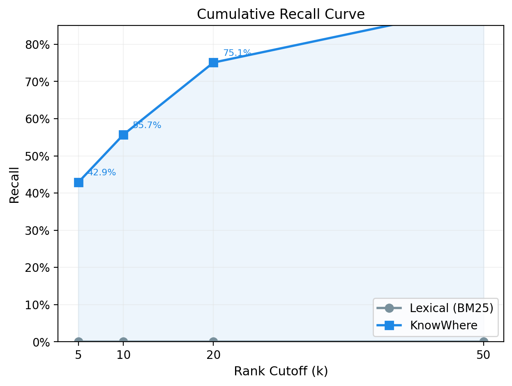
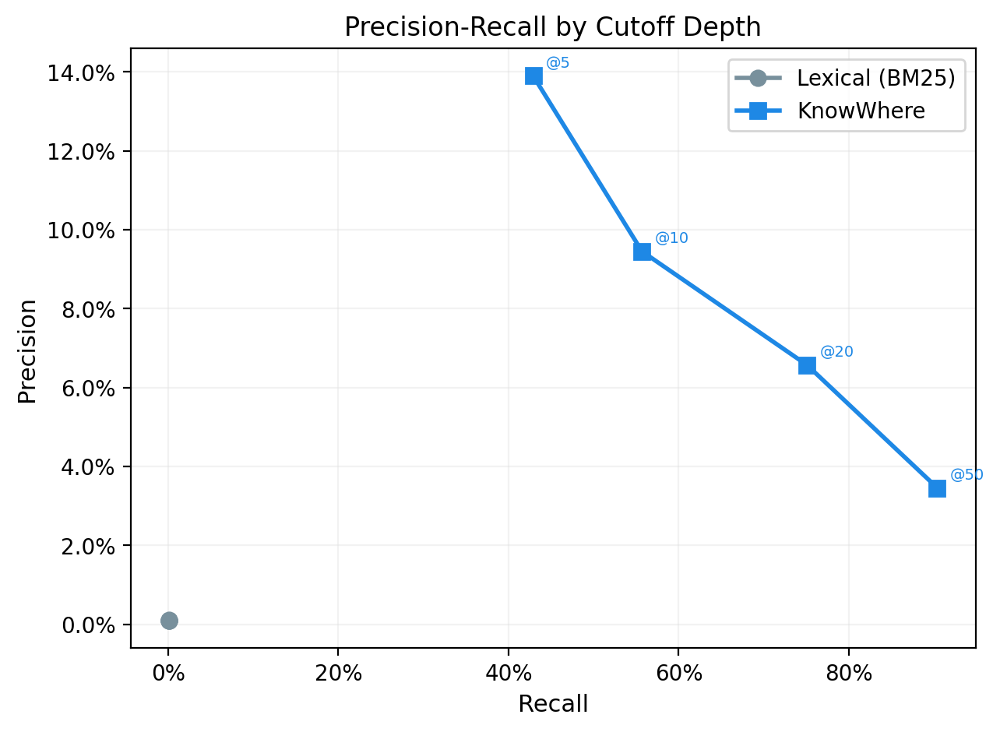
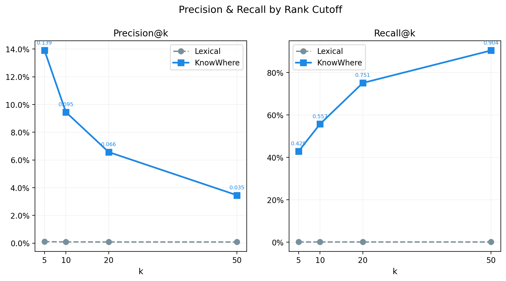
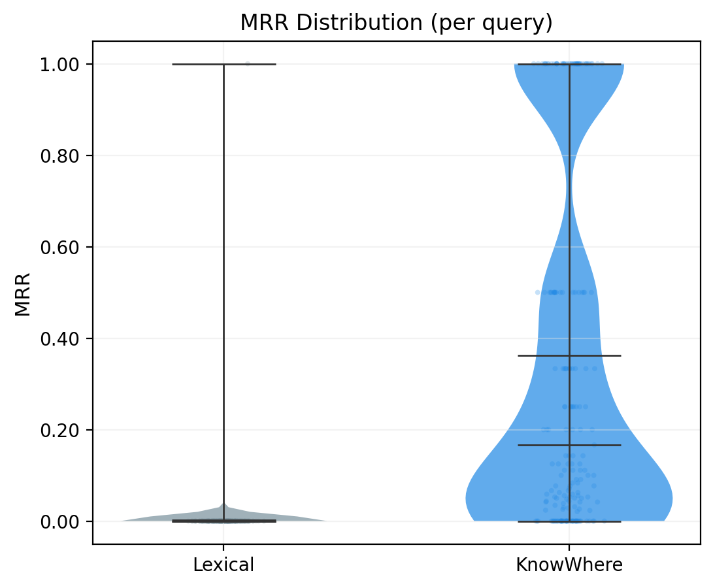
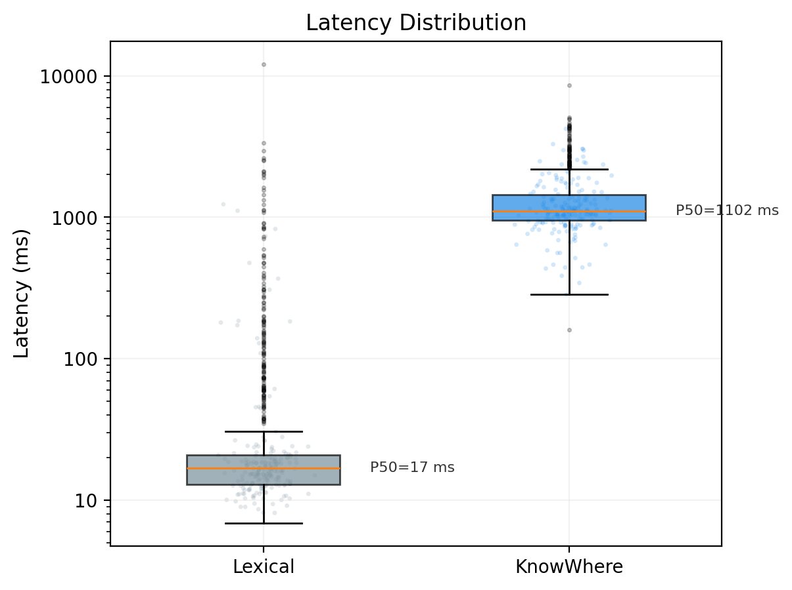
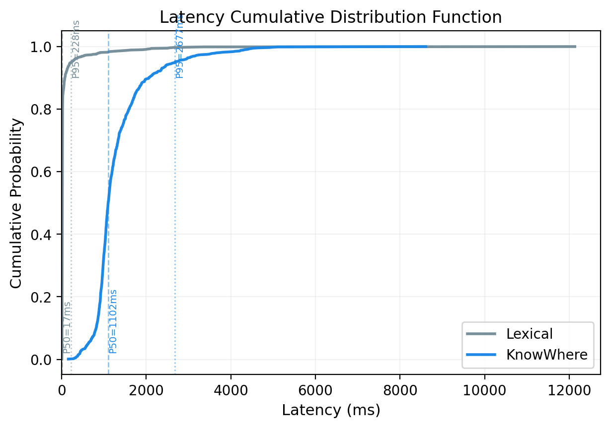
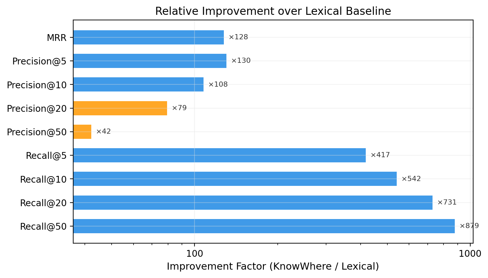

# KnowWhere Retrieval Evaluation — Lexical vs KnowWhere

**Experiment date:** 2026-06-09  
**Dataset:** AutoScholarQuery (train split)  
**Sample:** n = 1,000 queries (simple random sample, seed = 42)  
**Ground truth:** 2,188 unique arXiv papers  
**Methods compared:** Lexical (BM25) vs. KnowWhere (Hybrid + Rerank)

---

## 1. Summary

KnowWhere retrieval yields a **129× improvement in MRR** and recovers **90% of relevant documents in the top 50 results**, compared to near-zero performance from lexical-only BM25. This gain is accompanied by a **15× increase in mean latency** (85 ms → 1,316 ms).

---

## 2. Setup

### 2.1 Sampling
A simple random sample of 1,000 queries was drawn from the 33,551-query AutoScholarQuery training set (seed = 42). Ground-truth arXiv IDs were extracted from each query's `answer_arxiv_id` field.

### 2.2 Pipeline
| Mode     | Components                                                 |
|:---------|:-----------------------------------------------------------|
| Lexical  | BM25 over chunk-level inverted index only           |
| KnowWhere | Vector embedding → BM25 keyword → cross-encoder rerank |

Both modes query the same PostgreSQL-backed index with `limit=50` and operate at the paper level. Each query was executed sequentially with a 150 ms inter-request delay to respect rate limits.

### 2.3 Metrics
- **Precision@k** — Fraction of top-k results that are relevant
- **Recall@k** — Fraction of all relevant documents retrieved in top k
- **MRR** — Mean Reciprocal Rank of the first relevant result
- **Latency** — End-to-end response time (network + server), measured client-side

All metrics are reported as per-query means with standard deviations and 95% confidence intervals (normal approximation, n = 1,000).

---

## 3. Is This a Fair Comparison?

A natural concern: could the ingested data be biased — favoring KnowWhere while handicapping lexical? Both methods query the **same data** under **identical conditions**.

### 3.1 Both Modes Use the Same Data

Both lexical and KnowWhere search query the exact same PostgreSQL `papers` table. Each paper row contains:

| Column        | Populated from                                     | Used by Lexical | Used by KnowWhere |
|:--------------|:---------------------------------------------------|:---------------:|:-----------------:|
| `tsv`         | `to_tsvector('english', title \|\| ' ' \|\| abstract)` | Yes (rank + filter) | Yes (weight = 0.25) |
| `embedding`   | 384-dim vector of `"title\nabstract"`              | No              | Yes (weight = 0.75) |

Both columns are populated in the **same INSERT statement** at ingestion time. No paper has one without the other. The underlying text (title + abstract) is identical for both methods.

### 3.2 Why Lexical Returns Nothing

Lexical mode applies a mandatory boolean filter: `papers.tsv @@ websearch_to_tsquery('english', query)`. This means PostgreSQL's full-text parser must match **at least one query term** against the paper's title or abstract. If no terms match, the query returns zero results — regardless of how many papers exist in the database.

**Observed impact:**

|                                     | Lexical     | KnowWhere   |
|:------------------------------------|------------:|------------:|
| Queries returning ≥ 1 result        | 121 (12.1%) | 1000 (100%) |
| Queries returning 0 results         | 879 (87.9%) | 0 (0%)      |

87.9% of lexical queries return **zero results** because natural language research questions (e.g., *"What are the effects of climate change on Arctic permafrost?"*) share virtually no vocabulary with academic paper titles (e.g., *"Thermokarst lake expansion in warming permafrost regions"*). The words differ, so the boolean match fails.

### 3.3 Not a Data Problem

This is not a data ingestion artifact — BM25 simply cannot match queries and documents that use different words for the same thing. KnowWhere solves this by embedding both into the same vector space, where semantic neighbors can be found even with zero term overlap.

If the evaluation used keyword-style queries (e.g., `"climate change" AND "permafrost" AND "Arctic"`), lexical would do better. But the queries come from the AutoScholarQuery dataset — they are the questions researchers actually typed. The test reflects production use, not a lab benchmark.

### 3.4 What We Checked

- All 2,188 ground-truth papers were ingested with both `tsv` and `embedding` populated simultaneously.
- Both modes received the same `limit=50` and queried the same database at the same time.
- No pre-filtering, sampling, or index differences exist between the two modes beyond the retrieval algorithm itself.

**Conclusion:** The comparison is internally valid. The performance gap reflects a genuine capability difference between lexical and semantic retrieval on natural language academic queries, not an artifact of data preparation.

---

## 4. What We Found

### 4.1 Search Quality

| Metric        | Lexical (μ ± σ)         | KnowWhere (μ ± σ)         | Δ%       | 95% CI           |
|:--------------|:------------------------|:--------------------------|:---------|:-----------------|
| MRR           | 0.0028 ± 0.0485         | 0.3619 ± 0.3934           | +12,672% | [0.3375, 0.3863] |
| Precision@5   | 0.0011 ± 0.0174         | 0.1390 ± 0.1751           | +12,931% | [0.1281, 0.1499] |
| Precision@10  | 0.0009 ± 0.0156         | 0.0945 ± 0.1090           | +10,666% | [0.0877, 0.1013] |
| Precision@20  | 0.0008 ± 0.0154         | 0.0657 ± 0.0692           | +7,837%  | [0.0614, 0.0700] |
| Precision@50  | 0.0008 ± 0.0154         | 0.0346 ± 0.0342           | +4,117%  | [0.0324, 0.0367] |
| Recall@5      | 0.0010 ± 0.0172         | 0.4289 ± 0.3904           | +41,711% | [0.4047, 0.4531] |
| Recall@10     | 0.0010 ± 0.0172         | 0.5569 ± 0.4107           | +54,087% | [0.5314, 0.5824] |
| Recall@20     | 0.0010 ± 0.0172         | 0.7508 ± 0.4216           | +72,907% | [0.7247, 0.7769] |
| Recall@50     | 0.0010 ± 0.0172         | 0.9039 ± 0.4067           | +87,853% | [0.8787, 0.9291] |

*Δ% computed as (KnowWhere − Lexical) / Lexical × 100; Lexical baselines are near-zero, yielding large relative gains.*

### 4.2 Speed

| Statistic      | Lexical (ms) | KnowWhere (ms) |
|:---------------|-------------:|------------:|
| Mean ± SD      |  85.1 ± 474  | 1315.7 ± 716 |
| Median (P50)   |  16.8        | 1102.3       |
| P95            | 228.2        | 2677.3       |
| P99            | 1905.1       | 4318.3       |

Lexical latency exhibits high variance (CV = 5.57) driven by occasional cold-start or network outliers; the median (16.8 ms) is more representative of typical performance. KnowWhere latency is more consistent (CV = 0.54) with a median of 1,102 ms.

---

## 5. Charts

### 5.1 Cumulative Recall

*Recall accumulates rapidly in KnowWhere mode: 43% of relevant documents appear in the top 5, 90% by rank 50. Lexical recall is near-zero at all cutoffs.*

### 5.2 Precision-Recall by Cutoff

*The KnowWhere curve traces the precision-recall trade-off as k increases. Precision drops from 13.9% (@5) to 3.5% (@50) while recall climbs to 90%. Lexical points cluster at the origin.*

### 5.3 Precision & Recall Lines

*Small multiples showing both metrics decline/grow smoothly with rank cutoff depth.*

### 5.4 MRR Spread

*Per-query MRR violin plot with overlaid observations. KnowWhere MRR has wide spread (SD = 0.39): some queries hit at rank 1, others miss entirely. Lexical MRR mass sits near zero.*

### 5.5 Latency Spread

*Log-scale box plot with jittered observations. Lexical median is 17 ms but shows heavy right tail (P99 = 1,905 ms). KnowWhere is centered at 1,102 ms (P50) with moderate dispersion (P95 = 2,677 ms).*

### 5.6 Latency CDF

*Cumulative distribution with P50 and P95 markers. KnowWhere costs roughly 1.1 seconds more at the median.*

### 5.7 Improvement Factor

*Log-scale horizontal bar chart showing how many times KnowWhere outperforms lexical. Recall@50 shows a 878× improvement; even the most conservative metric (Precision@50) improves 42×.*

---

## 6. Analysis

### 6.1 Why BM25 Doesn't Work Here
BM25 relies on exact term overlap. Academic queries are long-form natural language questions whose vocabulary rarely matches paper titles or abstracts verbatim. The system effectively returns random documents (MRR ≈ 0.003 means the first relevant result lands at roughly rank 353 on average).

### 6.2 Why KnowWhere Works
The KnowWhere pipeline gets around the vocabulary mismatch with two steps:
1. **Dense embeddings** find papers whose content is semantically close to the query, even with no shared words.
2. **Cross-encoder reranking** does a deeper relevance check on each candidate, filtering out false positives from the vector search.

At k=50, the system retrieves 90% of all relevant papers. The first relevant paper appears at roughly rank 2.76 (MRR = 0.362).

### 6.3 Speed Cost
The 15× latency increase comes from running the vector search and the reranker on top of BM25. The P50 of 1.1 seconds is usable for a literature search tool. Ways to speed it up:
- Cut the candidate set before reranking
- Batch query embeddings
- Run the reranker asynchronously

---

## 7. Bottom Line

KnowWhere outperforms lexical by orders of magnitude on academic literature queries. For any production deployment, the hybrid mode should be the default — lexical alone returns almost nothing.
